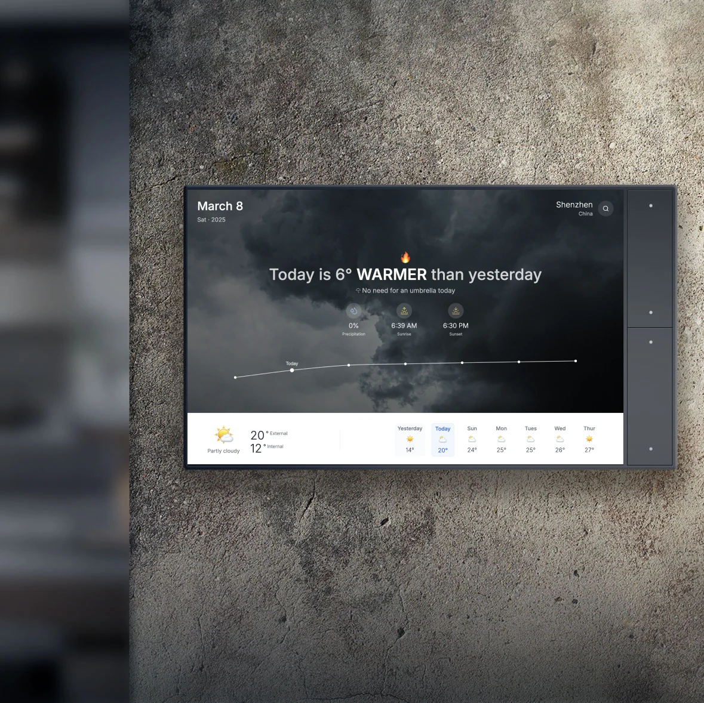

# WeatherWise



WeatherWise is a modern weather information website featuring a clean, elegant design and intelligent weather notification functionality. Through an intuitive interface, it displays weather information and provides thoughtful clothing and travel suggestions, allowing users to easily keep track of weather changes.

## Features

- **Real-time Weather Information**: Temperature, feels-like temperature, humidity, wind direction and speed, air quality index, and UV index
- **Temperature Comparison**: Visual display of temperature trends compared to yesterday
- **Smart Reminders**: Precipitation probability, umbrella recommendations, clothing suggestions, air quality alerts, and extreme weather warnings
- **Weather Forecast**: Yesterday's weather review, 7-day forecast, daily temperature range, and weather condition icons

## Tech Stack

- [Next.js](https://nextjs.org/) - React framework
- [React](https://reactjs.org/) - JavaScript library for building user interfaces
- [Tailwind CSS](https://tailwindcss.com/) - Utility-first CSS framework
- [Chart.js](https://www.chartjs.org/) - JavaScript charting library
- [Lucide Icons](https://lucide.dev/) - Beautiful & consistent icon toolkit

## Getting Started

First, run the development server:

```bash
npm run dev
# or
yarn dev
# or
pnpm dev
# or
bun dev
```

Open [http://localhost:3000](http://localhost:3000) with your browser to see the result.

## Environment Variables

Create a `.env.local` file in the root directory with the following variables:

```
NEXT_PUBLIC_UNSPLASH_ACCESS_KEY=your_unsplash_access_key
```

## APIs Used

This project uses the following APIs:

- [Open-Meteo API](https://open-meteo.com/) - Free weather API for weather data and geocoding
- [Unsplash API](https://unsplash.com/developers) - For beautiful weather-related background images

## Learn More

To learn more about the technologies used in this project:

- [Next.js Documentation](https://nextjs.org/docs)
- [React Documentation](https://reactjs.org/docs)
- [Tailwind CSS Documentation](https://tailwindcss.com/docs)
- [Open-Meteo API Documentation](https://open-meteo.com/en/docs)
- [Unsplash API Documentation](https://unsplash.com/documentation)

## License

This project is open source and available under the [MIT License](LICENSE).
