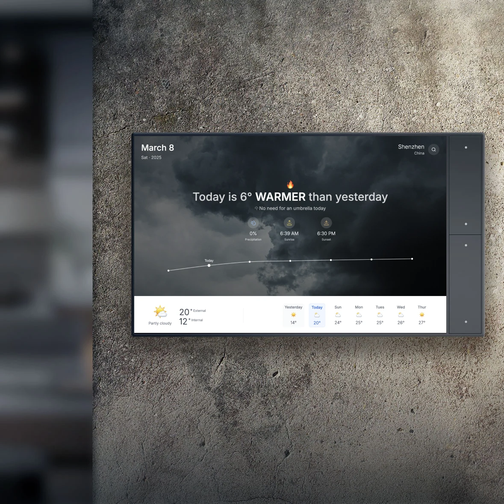

# WeatherWise 智能天气提醒网站



WeatherWise 是一个现代化的天气信息网站，主打简洁优雅的设计和智能化的天气提醒功能。通过直观的界面展示天气信息，并提供贴心的穿衣、出行建议，让用户轻松掌握天气变化。

## 功能特点

- **实时天气信息**：温度、体感温度、湿度、风向风速、空气质量指数、紫外线指数
- **温度对比功能**：直观的视觉设计展示今日与昨日的温度变化趋势
- **智能提醒**：降水概率提醒、带伞建议、穿衣建议、空气质量提醒、极端天气预警
- **天气预报**：昨日天气回顾、未来7天天气预报、每日温度范围、天气状况图标展示

## 技术栈

- [Next.js](https://nextjs.org/) - React 框架
- [React](https://reactjs.org/) - 用于构建用户界面的 JavaScript 库
- [Tailwind CSS](https://tailwindcss.com/) - 实用优先的 CSS 框架
- [Chart.js](https://www.chartjs.org/) - JavaScript 图表库
- [Lucide Icons](https://lucide.dev/) - 美观一致的图标工具包

## 快速开始

首先，运行开发服务器：

```bash
npm run dev
# 或
yarn dev
# 或
pnpm dev
# 或
bun dev
```

使用浏览器打开 [http://localhost:3000](http://localhost:3000) 查看结果。

## 环境变量

在根目录创建 `.env.local` 文件，包含以下变量：

```
NEXT_PUBLIC_UNSPLASH_ACCESS_KEY=你的_unsplash_access_密钥
```

## 使用的API

本项目使用以下API：

- [Open-Meteo API](https://open-meteo.com/) - 免费的天气数据和地理编码API
- [Unsplash API](https://unsplash.com/developers) - 用于获取美丽的天气相关背景图片

## 了解更多

要了解有关本项目使用的技术的更多信息：

- [Next.js 文档](https://nextjs.org/docs)
- [React 文档](https://reactjs.org/docs)
- [Tailwind CSS 文档](https://tailwindcss.com/docs)
- [Open-Meteo API 文档](https://open-meteo.com/en/docs)
- [Unsplash API 文档](https://unsplash.com/documentation)

## 许可证

本项目是开源的，根据 [MIT 许可证](LICENSE) 提供。 